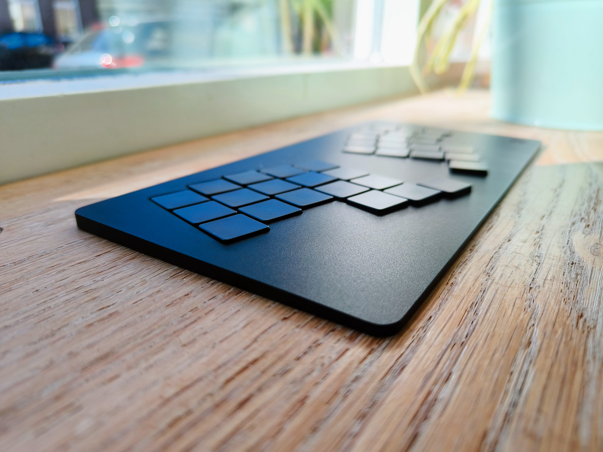

# mikecinq keyboard by Mike Hölscher

Shield: [![CC BY-NC-SA 4.0][cc-by-nc-sa-shield]][cc-by-nc-sa]

This work is licensed under a
[Creative Commons Attribution-NonCommercial-ShareAlike 4.0 International License][cc-by-nc-sa].

[![CC BY-NC-SA 4.0][cc-by-nc-sa-image]][cc-by-nc-sa]

[cc-by-nc-sa]: http://creativecommons.org/licenses/by-nc-sa/4.0/
[cc-by-nc-sa-image]: https://licensebuttons.net/l/by-nc-sa/4.0/88x31.png
[cc-by-nc-sa-shield]: https://img.shields.io/badge/License-CC%20BY--NC--SA%204.0-lightgrey.svg

### about the license
This license enables reusers to distribute, remix, adapt, and build upon the material in any medium or format for noncommercial purposes only, and only so long as attribution is given to the creator. If you remix, adapt, or build upon the material, you must license the modified material under identical terms. CC BY-NC-SA includes the following elements:

- BY: credit must be given to the creator.
- NC: Only noncommercial uses of the work are permitted.
- SA: Adaptations must be shared under the same terms.

If you wish to commercially exploit this design, contact me at info@mikeholscher.nl.

mikecinq is a blend of my own [mikefive](https://github.com/mikeholscher/zmk-config-mikefive) keyboard with esthetic inspiration from [Le Chifre](https://github.com/tominabox1/Le-Chiffre-Keyboard) and [Le Oeuf](https://github.com/eggsworks/le-oeuf).
Just like mikefive it features Kailh PG1316S switches in Corne unibody layout and a total height of 5mm.

- In the files folder, you can find all the files to order and build your own mikecinq.
- This repo also contains all the files to build your own ZMK firmware using GitHub Actions.
- You can customize your layout using ZMK Keymap Editor or ZMK Studio.

### about what you need
- 1x mikecinq PCB
- 1x mikecinq case
- 1x nice!nano v2 (or similar)
- 36x Kailh PG1316S switch and keycap
- 36x 1N4148W SOD-123 diode
- 1x MSK12C02 power switch
- 1x 301230 lipo battery
- 19x M1.6x2 screws

Optionally, to improve ESD performance, 0603 (1608 metric) SMD components of any value:
- 1x resistor
- 1x capacitor
- 1x ferrite bead

### about the recommended tools
- hotplate
- solder paste
- soldering iron
- solder
- flux
- stationary drill
- countersinking drill bit
- screwdriver to match your screws

### about the pcb
Somehow, JLCPCB online viewer renders the PCB preview weirdly. Maybe because of the many cutouts, including castellated holes, I don't know. I checked the files with a JLC service employee, and they are fine. Remember to order a 0.8mm PCB and select castellated holes in the options. Also, I was too lazy and unskilled to remove the 4 bottom contacts of the nice!nano footprint in the PCB file which are floating mid air, of which JLC might ask you if it is OK to cut those away. Yes, they should be cut away.

### about soldering
I STRONGLY advise to use a hotplate for soldering the switches to the top of the PCB. You really have to be a pro to solder the switch frames to the PCB using only an iron. Reworking a switch is impossible using an iron because of the large thermal mass of the metal switch frame. Surface mounting using a hotplate is the easiest and neatest way of soldering I have ever done. I used a Miniware MHP30 and did the switches one by one. The important thing to be soldered by hand is the switch contacts through the holes on the bottom of the PCB. This is done on purpose because surface mounting these switch contacts reliably is somehow very hard. You can choose to do the nice!nano by hand or surface mount it too. I used Chipquik TS391LT No-clean soldering paste lead-free and Chipquik CQ4LF fluxpen. I just applied tiny blobs on the PCB and did not use a stencil. And don't solder with keycaps mounted.

### about the battery placement
All component placement is quite clear on the PCB, except maybe the battery. Orient the battery sideways against the right side of the MCU with the leads on the right side, pointing down. Do a test fit of the case on the PCB, including the battery, before soldering to check if you have the right orientation. Bend the leads close around the battery towards the + en - pads. Cut the leads to length, strip, and solder both. The leads are of different lengths to prevent accidental shorting.

### about the screws
For the thinnest result (5mm complete height), use countersunk screws with extra small heads, like [these](https://www.ebay.nl/itm/185164561040?var=694434686738). If you will be using bumpers on the bottom, you can also opt for thin head, non-countersunk screws. I you want to go countersunk, you need a countersinking drill bit to make countersunk holes in the PCB. I strongly advise to do this on a stationary drill, as countersinking with a hand drill makes terrible asymmetric holes. I used a 6.3mm size countersinking drill bit, placed the PCB on a steel sheet, and just drilled down in the PCB until the drill bit hit the steel sheet, to make all countersunk holes the same depth/size.

### about ESD protection
You will see a single screw hole in the center of the PCB has a ring-shaped pad around it. This pad is meant for electrically coupling the metal case to the PCB to form a nice grounded chassis around the electronics. To make this connection work, you need to scratch off the anodizing of the case slightly around this screw hole, as the anodizing is not conductive. The metal switch frames, ground planes, and case form the 'chassis ground', which is coupled to 'circuit ground' by the resistor, capacitor, and ferrite bead. This way, the circuit is protected from any static discharge that might occur when touching conductive parts on the keyboard. Probably overkill, but it was a simple and effective optional addition.  

### about the typing experience
Go for the 35g version of the switch. The 65g is insane. These switches are rough diamonds: out of the box with stock caps, they are pretty bad. Rattly, harsh. You can quickly upgrade by using the papermod1 or papermod2. These are pieces of paper that you can cut and put under the stock keycap to instantly level up the typing experience. Papermod1 removes slack and rattle, and papermod2 additionally softens bottom-out and therefore quietens. The cutting template for both can be found [here](https://github.com/mikeholscher/zmk-config-mikefive/tree/main/files/mods). Lubing the switches, springs, and keycap inside corners can elevate and smooth out the typing experience further.

### about removing keycaps
This is hard. Be gentle or you will bend the switch, which means SMD reworking, which you do not want. While mounted, slide the keycap towards the top or bottom row and lift a corner on the side you are pushing towards. IMPORTANT: After lifting the first corner, lift the other corner on that top row or bottom row side! Prevent releasing the left or right side corners first! You will bend the tiny metal arms a lot more easily if you leave only the left or right side of the cap attached. So: first release to the two top (or bottom) corners, and NOT the two right or left side corners of the cap.

### disclaimer
Building and tweaking this keeb is unlike a Choc or MX board. These PG1316 switches are relatively new and are designed to be attached to PCBs in professional reflow ovens in large quantities. They are not meant for the DIY community. Soldering is hard, removing keycaps is hard, and the parts are tiny and unforgiving. You WILL find yourself swearing when building this keeb.  

